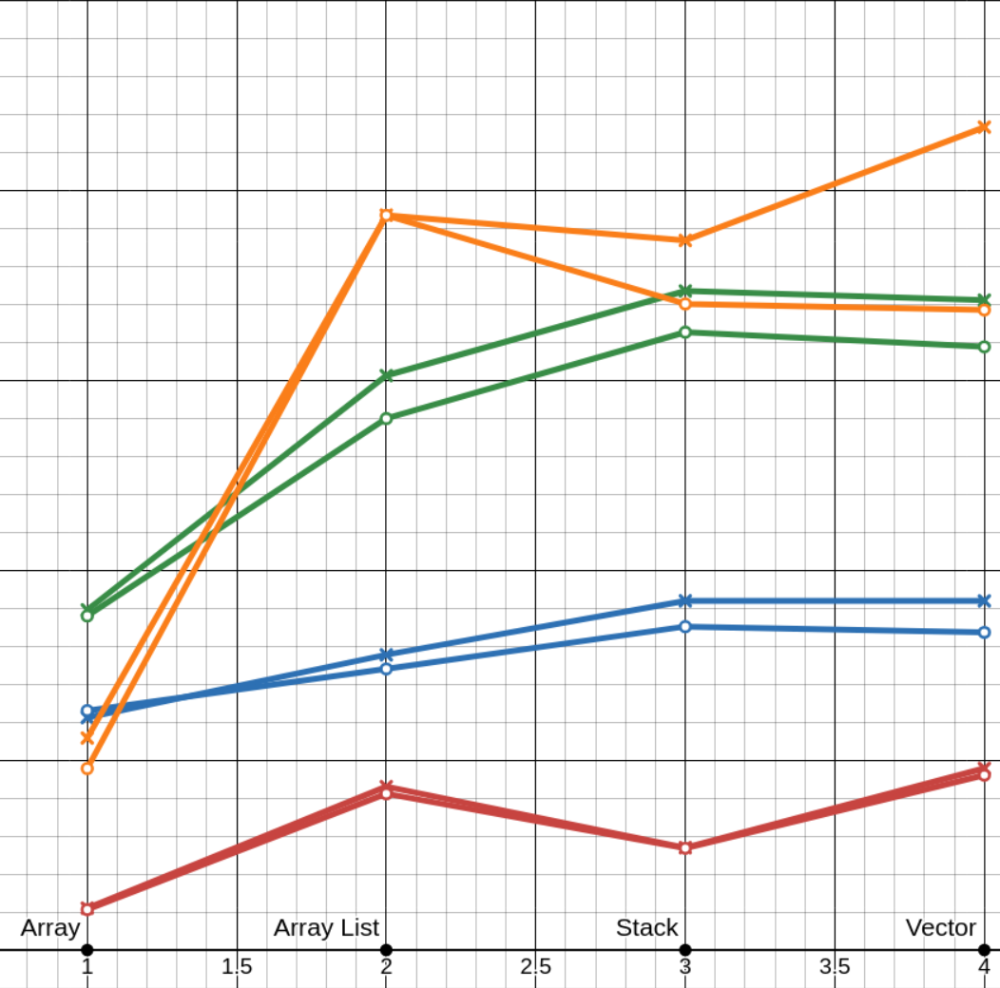
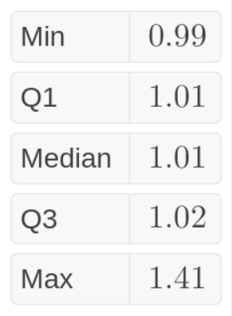
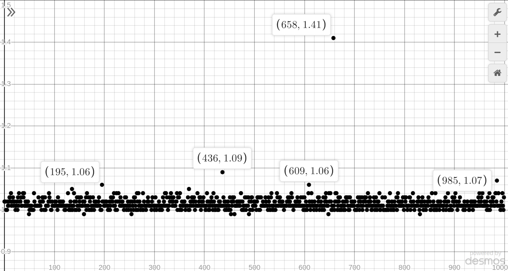

# Project 3: Turing Machine Simulator

# Reflection
## Jacob

### Preface
I wasn't happy with how the last two projects turned out. I knew I could do better than those flaming trash piles. The extra credit points gave me extra incentive to try hard. Only time will tell if these efforts were fruitful, but I've got a good feeling...

```bash
$ time java TMSimulator.java 1> /dev/null
real    0m0.990s
user    0m1.022s
sys     0m0.014s
```

### Back to the drawing board
I went back to the drawing board. Since the priority is performance, I decided to throw every object oriented container straight into ```/dev/null```. Good riddence. Instead, I based my implementation off of the venerable array. 

### Tape interface
Divide 3 TM from HW 7



### One tape or?
An array is worse at representing a binfinite array than two arrays

### 1,000 runs later...

